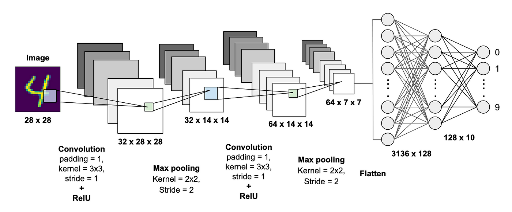

# MNIST Classifier Application

This application provides functionalities for training, inference, and validation of a convolutional neural network (CNN) based MNIST digit classifier. It also includes Docker support for easy deployment and execution.


# Architecture



# Configuration File
The configuration file (configuration_file.yml) specifies settings for training and inference. Refer to the provided template for configuring the application.

```yaml
train:
  device: # cuda:0 etc
  train_dataset_path: # path/to/train/dataset
  validation_dataset_path: # path/to/validation/dataset
  batch_size: 8
  learning_rate: 0.0001
  number_of_epochs: 10
  model_save_path: # path/to/save/models
  save_check_point: 1
  model_path: # path/to/pre-trained/model

inference:
  device: # cuda:0 etc
  test_dataset_path: # path/to/test/dataset
  model_path: # path/to/model
```

**Specify Training Parameters**: You can define parameters such as device (CPU or GPU), paths to training and validation datasets, batch size, learning rate, number of epochs, model save path, and frequency of saving model checkpoints during training.

**Configure Inference Settings**: In the inference section of the configuration file, you can specify the device (CPU or GPU), path to the test dataset, and the path to the pre-trained model for performing inference on unseen data.

**Customize Model Paths**: You can specify paths to pre-trained models for both training and inference, allowing you to resume training from a checkpoint or use a specific model for inference.

**Flexibility and Reusability**: By using a configuration file, you separate the application logic from the configuration details. This separation allows for easier maintenance, reusability of code, and flexibility to experiment with different settings without modifying the codebase.

**Ease of Deployment**: Having a configuration file makes it easier to deploy the application in different environments or on different machines. You can simply modify the configuration file to adapt to specific hardware configurations or data locations.

**Consistency**: Using a configuration file promotes consistency across different runs of the application. By centralizing all parameters in one place, you reduce the chances of errors due to inconsistent settings.

Overall, the configuration file provides a convenient and flexible way to customize and manage various aspects of the MNIST classifier application, making it easier to train models, perform inference, and experiment with different settings.

# Installation Guide and Usage Instructions

### Prerequisites

Before running the MNIST classifier application, ensure you have the following prerequisites installed on your system:

* Docker
* Visual Studio Code (VSCode)
* Remote - Containers extension for VSCode


### Installation

1. Clone the repository to your local machine:
```bash
git clone https://github.com/AdnanEkici/MNISTClassification.git
```

2. Navigate to the project directory:
```bash
cd MNISTClassification
```

3. Install the required Python packages:
```bash
pip install -r requirements.txt
```

### Training

To train the MNIST classifier model, follow these steps:

1. Prepare your training and validation datasets in CSV format, where each row represents an image with pixel values and labels.

2. Update the configuration_file.yml with the paths to your training and validation datasets, desired training parameters, and model save path.

3. Run the training script:

```bash
python mnist_classifier_app\scripts\train.py -c configuration_file.yml
```

or

Running Containerized Training

1. Install the Remote - Containers extension if you haven't already.

2. Press Ctrl + Shift + P (Windows/Linux) or Cmd + Shift + P (Mac) to open the command palette in VSCode.

3. Select 'Tasks:Run Task' option.

4. Select 'Start Training' from the command palette.

5. Type the desired configuration file name (e.g., configuration_file.yml) when prompted. Ensure the configuration file is located in the configuration_files directory.

6. Press Enter to start the training process inside the container.

##### Monitoring Progress
You can monitor the training progress and view logs directly within VSCode by opening the integrated terminal and selecting the appropriate tab for logs or using the VSCode built-in terminal to run commands.

The MNIST Classifier Application includes support for TensorBoard, a visualization tool provided by TensorFlow, which can be used to monitor the training process, visualize model graphs, and analyze training metrics.


##### Stopping Training

To stop the training process, simply close the VSCode window or terminate the containerized environment.

### Inference
To perform inference on test data using a pre-trained model, follow these steps:

1. Update the configuration_file.yml with the path to your test dataset and the path to the pre-trained model.

2. Run the inference script:
```bash
python mnist_classifier_app\scripts\inference.py -c configuration_file.yml
```

or

Running Containerized Inference

1. Install the Remote - Containers extension if you haven't already.

2. Press Ctrl + Shift + P (Windows/Linux) or Cmd + Shift + P (Mac) to open the command palette in VSCode.

3. Select 'Tasks:Run Task' option.

4. Select "Run Inference" from the command palette.

5. Type the desired configuration file name (e.g., configuration_file.yml) when prompted. Ensure the configuration file is located in the configuration_files directory.

6. Press Enter to start the training process inside the container.


### Starting Containerized Development

Open the cloned repository in VSCode.

1. Install the Remote - Containers extension if you haven't already.

2. Press Ctrl + Shift + P (Windows/Linux) or Cmd + Shift + P (Mac) to open the command palette in VSCode.

3. Select Tasks: 'Up Mnist App' option.

4. Then to work on selected container open task menu and select 'Attach Mnist App Dev' or you can attach to your vscode using docker explorer.

5. After your development completed. You can down development contair from Run Tasks with 'Down Mnist App' option.

6. Press Enter to start the training process inside the container.

### LICENSE
This project is licensed under the MIT License. See the LICENSE file for details.
